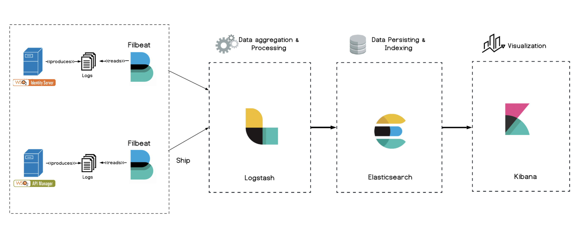

# Introduction to the ELK Stack

The ELK Stack contains three major components named Elasticsearch, Logstash and Kibana. Later on a new addition named Beats was introduced to the ELK stack. 

ELK is a powerful platform that could be used to collect and process data from multiple data sources and further store that data in one centralized data store that can scale as data grows. It also  provides a set of important tools which is of immense help to analyze the collected data.

## Elasticsearch

Elasticsearch is the database of the ELK stack in which the raw data from logs and analyzed data is being stored.

## Logstash

Logstash collects logs, converts them accordingly and stores that data in Elasticsearch for further analysis.

## Kibana

Kibana is being used to visualize data in a meaningful manner and to provide a user-friendly interface to perform certain Elasticsearch operations.

## Beats

Beats are single-purpose data shippers and in this scenario Filebeat is being used to ship logs to Logstash. 

# Project Architecture



# Configuring ELK

#### Installing Elasticsearch

1. [Install Elasticsearch](https://www.elastic.co/guide/en/elastic-stack-get-started/current/get-started-elastic-stack.html#install-elasticsearch)
   according to your operating system.
2. The configurations in [here](elasticsearch/elasticsearch.yml) can be referred when configuring the Elasticsearch component. Make the required changes in the configurations based on you setup.
3. Make sure Elasticsearch is [up and running](https://www.elastic.co/guide/en/elastic-stack-get-started/current/get-started-elastic-stack.html#_make_sure_that_elasticsearch_is_up_and_running).

#### Installing Logstash

1. [Install Logstash](https://www.elastic.co/guide/en/logstash/current/installing-logstash.html) according to your operating system.
2. The configurations in [here](logstash/logstash.conf) can be referred when configuring the Logstash component. Make the required changes in the configurations based on you setup.
3. Make sure Logstash is [up and running](https://www.elastic.co/guide/en/logstash/current/running-logstash-command-line.html#running-logstash-command-line).

#### Installing Filebeat

1. [Install Filebeat](https://www.elastic.co/guide/en/beats/filebeat/current/filebeat-installation-configuration.html#installation) according to your operating system.
2. The configurations in [here](filebeat/filebeat-iam.yml) can be referred when configuring the Filebeat component for the Identity Server and the configurations in [here](filebeat/filebeat-am.yml) can be referred when configuring the Filebeat component for the APIM Server. Make the required changes in the configurations based on you setup.
3. Make sure Filebeat is [up and running](https://www.elastic.co/guide/en/beats/filebeat/current/filebeat-starting.html).

#### Installing Kibana

1. [Install Kibana](https://www.elastic.co/guide/en/elastic-stack-get-started/current/get-started-elastic-stack.html#install-kibana) according to your operating system.
2. The configurations in [here](kibana/kibana.yml) can be referred when configuring the Kibana component. Make the required changes in the configurations based on you setup.
3. Make sure Kibana is [up and running](https://www.elastic.co/guide/en/elastic-stack-get-started/current/get-started-elastic-stack.html#_access_the_kibana_web_interface).

# Enable the logs required for ELK in the WSO2 Open Banking Solution

Follow the steps below to enable the logs required for ELK-based analytics in the WSO2 Open Banking Solution.

1.  Open the `log4j2.properties` file in the
    `<IS_HOME>/repository/conf` directory.

2. Add the following configurations in the `log4j2.properties` file.

Add ANALYTICS_EVENT_LOGFILE to the list of all appenders as follows:

`appenders = {other appenders} , OB_LOGFILE`

Add the following appender configs:
```
appender.OB_LOGFILE.type = RollingFile
appender.OB_LOGFILE.name = OB_LOGFILE
appender.OB_LOGFILE.fileName = ${sys:carbon.home}/repository/logs/ob_logs.log
appender.OB_LOGFILE.filePattern = ${sys:carbon.home}/repository/logs/ob_logs-%d{MM-dd-yyyy}.log
appender.OB_LOGFILE.layout.type = PatternLayout
appender.OB_LOGFILE.layout.pattern = [%d] %5p {%c} - %m%ex%n
appender.OB_LOGFILE.policies.type = Policies
appender.OB_LOGFILE.policies.time.type = TimeBasedTriggeringPolicy
appender.OB_LOGFILE.policies.time.interval = 1
appender.OB_LOGFILE.policies.time.modulate = true
appender.OB_LOGFILE.policies.size.type = SizeBasedTriggeringPolicy
appender.OB_LOGFILE.policies.size.size=10MB
appender.OB_LOGFILE.strategy.type = DefaultRolloverStrategy
appender.OB_LOGFILE.strategy.max = 20
appender.OB_LOGFILE.filter.threshold.type = ThresholdFilter
appender.OB_LOGFILE.filter.threshold.level = INFO`
```

Add org.wso2.carbon.event.output.adapter.logger.LoggerEventAdapter to the list of all loggers as follows:

`loggers = {existing loggers}, OB_LOG`

Add the following logger configs:
```
logger.OB_LOG.name = OB_LOG
logger.OB_LOG.level = INFO
logger.OB_LOG.appenderRef.AUDIT_LOGFILE.ref = OB_LOGFILE
logger.OB_LOG.additivity = false`
```

3.  Open the `log4j2.properties` file in the
    `<APIM_HOME>/repository/conf` directory and add the same configurations made in the previous step.

# Configure ELK in the WSO2 Open Banking Solution

Follow the steps below to enable ELK-based analytics in the WSO2 Open Banking Solution.

1. Open the `deployment.toml` file in the
    `<IS_HOME>/repository/conf` directory.

2. Enable the following configuration in the `deployment.toml` file.

    ```
    [open_banking.analytics.elk]
    enable=true
    ```

3. Open the `deployment.toml` file in the
    `<APIM_HOME>/repository/conf` directory and add the same configurations made in the previous step.

**The official Open Banking documentation can be referred to get more detailed information on [Configuring ELK with the OB Accelerators](https://ob.docs.wso2.com/en/latest/learn/data-publishing-tryout/).**
